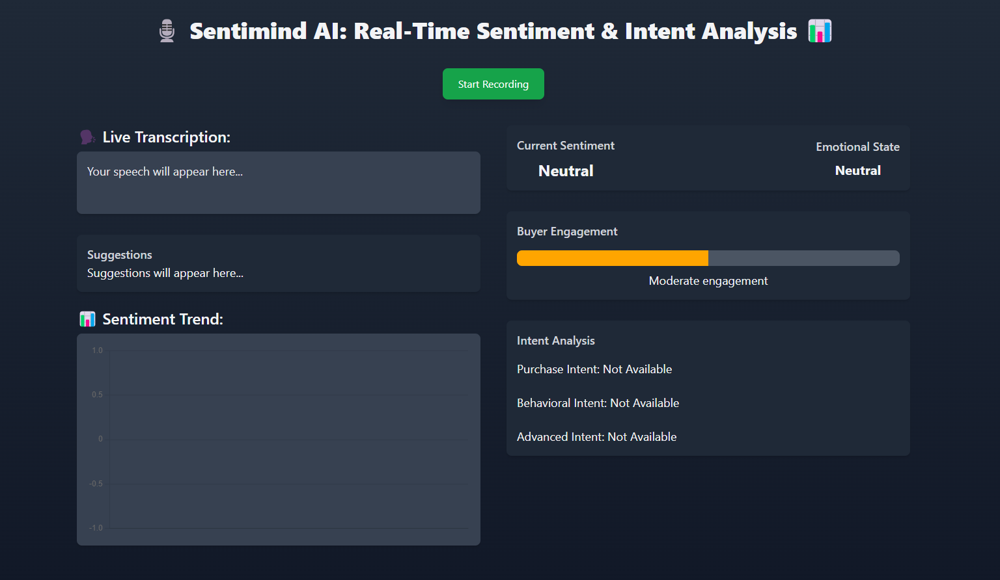

# Real-Time AI Sales Intelligence and Sentiment-Driven Deal Negotiation Assistant



Real-Time AI Sales Intelligence and Sentiment-Driven Deal Negotiation Assistant aims to transform the sales process by developing an AI-powered assistant that provides real-time sentiment analysis, intent detection, personalized recommendations, and negotiation coaching. 

It reduces manual effort, improves customer engagement, and optimizes the sales workflow. 

## Features

- **Real-Time Sentiment Analysis**: Detects the sentiment of the conversation (Very Positive, Positive, Neutral, Negative, Very Negative)
- **Emotion Detection**: Identifies the emotional state of the buyer (Excitement, Frustration, etc.)
- **Buyer Engagement Analysis**: Assesses the level of buyer engagement (Low, Moderate, High)
- **Purchase Intent Analysis**: Classifies the buyer's purchase intent (Immediate, Exploratory, etc.)
- **Behavioral Intent Analysis**: Identifies behavioral intent signals (Website browsing, Cart abandonment, etc.).
- **Advanced Intent Detection**: Detects advanced intent markers (High-value lead identification, etc.).
- **Integration with CRM and Google Sheets**: Stores and analyzes data for future reference
- 
## Demo

<!-- Add a GIF or video demo of your project in action -->

## Table of Contents

- [Installation](#installation)
- [Usage](#usage)
- [Features](#features)
- [API Documentation](#api-documentation)
- [License](#license)
- [Contact](#contact)
- [Acknowledgments](#acknowledgments)

## Installation

### Prerequisites

- Python 3.x
- Groq API Key (Sign up at [Groq](https://www.groq.com))
- Google Sheets & Drive API (Enable at[Google Cloud Console](https://console.cloud.google.com))

### Steps

1. Clone the repository:

    ```bash
    git clone https://github.com/Resultyst/Infosys_Real_Time_Sales_Intelligence.git
    cd Infosys_Real_Time_Sales_Intelligence
    ```

2. Set up the backend:

    ```bash
    pip install -r requirements.txt
    ```

3. Set up the frontend:

     Serve the `index.html` file.

4. Set environment variables:

     Create a `.env` file in the root directory and add your Groq API key:

      ```env
      GROQ_API_KEY=your_groq_api_key_here
      ```

5. Run the Flask app:

    ```bash
    python app.py
    ```

6. Open the application in your browser:

    ```
    http://localhost:5000
    ```

## Usage

1. Open the application in audio supported browser.
2. Click **Start Recording** to begin speech recognition.
3. Speak into the microphone just like a sales call.
4. View real-time insights (sentiment, emotion, engagement, etc.) on the dashboard.
5. Click **Stop Recording** to end the session.
6. Save the transcription and analysis results to an Excel file.

## API Documentation

### Endpoint: `/get_response`

- **Method**: POST
- **Request Body**:

    ```json
    {
      "user_input": "Transcribed text from the user"
    }
    ```

- **Response Body**:

    ```json
    {
      "response": "User input",
      "sentiment": "Positive",
      "emotion": "Excitement",
      "engagement": "High",
      "purchase_intent": "Immediate purchase intent",
      "behavioral_intent": "Website browsing intent",
      "advanced_intent": "High-value lead identification",
      "suggestions": "Suggestions based on the input"
    }
    ```

## License

This project is licensed under the MIT License. See the [LICENSE](./LICENSE) file for details.

## Contact

For questions or feedback, feel free to reach out:

- **Email**: resultyst@gmail.com
- **GitHub**: [Resultyst](https://github.com/Resultyst)
- **LinkedIn**: [Suryaa Narayanan K](https://www.linkedin.com/in/resultyst7/)

## Acknowledgments

- **Groq** for providing the AI API.
- **Flask** for the backend framework.
- **Tailwind CSS** for the frontend styling.
